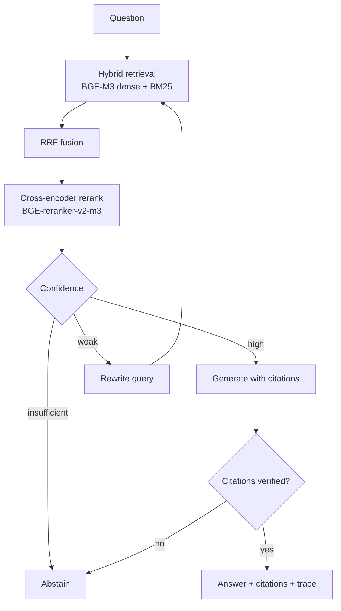

# RAGuard

Self-healing hybrid RAG with automated evaluation CI/CD.

A retrieval-augmented question-answering system for e-commerce customer support that treats
**not answering** as a valid outcome. RAGuard detects weak retrieval, rewrites the query and
retries, verifies that every claim is supported by a cited passage, and abstains when it cannot
prove the answer. A golden-dataset evaluation runs on every commit and blocks merges that
regress retrieval quality.

---

## Why this exists

A conventional RAG pipeline fails in five ways that are invisible until a user is harmed:

| Failure | RAGuard's countermeasure |
| --- | --- |
| Retrieves irrelevant chunks | Hybrid dense + BM25 retrieval fused with RRF, then cross-encoder reranking |
| Misses exact terms (`PAY-402`, `RT-014`) | Identifier-preserving BM25 tokeniser; exact-keyword recall is a tracked metric |
| Hallucinates when context is thin | Reranker-derived confidence score gates generation; low confidence abstains |
| Produces wrong or invented citations | Deterministic citation verification: labels must exist, numbers must appear literally |
| Silently degrades after a prompt or model change | Golden-dataset regression gate in CI, with a committed baseline |

---

## Architecture



Every decision in that graph is recorded in the response `trace`, which the Streamlit UI renders
and the evaluation harness measures.

---

## Quick start

**Python version.** Use 3.11 or 3.12. PyTorch and `sentence-transformers` wheels lag new CPython
releases, and this machine's default 3.14 will fail to install `torch`. Create the environment
with an explicit interpreter.

```bash
py -3.12 -m venv .venv
```

```bash
.venv\Scripts\Activate.ps1
```

```bash
pip install -r requirements.txt
```

Start PostgreSQL with pgvector:

```bash
docker compose up -d db
```

Configure the environment:

```bash
copy .env.example .env
```

Add a Google AI Studio key to `.env` as `GOOGLE_API_KEY`. Retrieval and the deterministic
evaluation tier work without it; only answer generation and query rewriting need it.

Ingest the corpus (downloads roughly 2.2 GB of model weights on first run):

```bash
python -m src.ingestion.ingest --reset
```

Run the API and the UI in two terminals:

```bash
uvicorn api.main:app --reload --port 8000
```

```bash
streamlit run frontend/app.py
```

---

## Evaluation

Two tiers, separated on purpose.

**Tier 1 — deterministic, blocks merges.** Retrieval-only metrics with no LLM call: hit rate,
MRR, exact-keyword recall, mean confidence. Identical code always produces identical numbers,
which is the only property that makes a merge gate trustworthy.

```bash
python -m src.evaluation.run_eval --tier retrieval --save --fail-on-regression
```

**Tier 2 — LLM-judged, reports only.** End-to-end behaviour and the Ragas suite (faithfulness,
response relevancy, context precision and recall). These vary between runs on identical code, so
they run nightly and never block a merge.

```bash
python -m src.evaluation.run_eval --tier e2e --save
```

```bash
python -m src.evaluation.run_eval --tier ragas --save
```

Test tiers mirror the same split:

```bash
pytest -m "not integration and not heavy and not llm"
```

Thresholds live in [baseline.json](src/evaluation/baseline.json). Raising a threshold to turn a
red build green is the exact failure this project exists to prevent, so baseline changes belong
in their own commit with the report that justifies them.

---

## Project structure

```
data/policies/          Mock support corpus (6 documents, seeded with real identifiers)
src/config/             Settings; every tunable constant lives here
src/retrieval/          embeddings.py, bm25.py, vector_store.py, hybrid.py (RRF)
src/reranking/          cross_encoder.py; also produces the confidence signal
src/ingestion/          Chunking, heading-aware context, idempotent pgvector upsert
src/generation/         llm_provider.py (Gemini/Ollama), prompts.py, answer_chain.py
src/self_healing/       confidence.py, query_rewriter.py, citation_verifier.py, pipeline.py
src/evaluation/         golden_dataset.json, baseline.json, metrics.py, run_eval.py
api/                    FastAPI service
frontend/               Streamlit UI built around the guard rails, not the chat bubble
tests/                  Dataset integrity, guard logic, pipeline integration
.github/workflows/      ci.yml (gate) and nightly-eval.yml (LLM-judged)
```

### Changes made to the original specification

- `__init__.py` (double underscores). The proposed `_init_.py` is not a package marker and would
  break every import.
- Added `src/generation/` and `src/self_healing/`. The original tree had nowhere to put the
  project's actual contribution: rewriting, confidence, verification, and abstention.
- Added `src/retrieval/vector_store.py`. Ingestion and retrieval both need the schema and the
  connection pool; duplicating that across two modules invites drift.
- Added `src/evaluation/run_eval.py` and `baseline.json`. A regression gate needs a committed
  reference point and a CLI that returns a non-zero exit code.
- Split CI into a deterministic gate and a nightly LLM-judged report, rather than running Ragas
  on every commit.

---

## Design decisions worth defending

- **RRF over weighted score fusion.** Cosine similarity and BM25 scores are not comparable, and a
  tuned blend weight silently invalidates historical evaluation runs. RRF consumes only ranks.
- **The reranker doubles as the confidence signal.** A separate confidence model would be another
  component to train and justify; the cross-encoder already scores query-document relevance.
- **Deterministic citation checks before LLM checks.** A fabricated number is the most damaging
  hallucination in a policy assistant and is catchable with string matching. The LLM entailment
  check is an optional second layer, not the first line.
- **Abstention is a success metric, not an error rate.** Over-abstention is tracked separately as
  `answer_rate`, so the two failure directions are visible independently.

## Known limitations

- `rank_bm25` holds the index in memory and rebuilds it from PostgreSQL at start-up. Correct at
  this corpus size; replace with PostgreSQL full-text search (`tsvector` + GIN) beyond roughly
  10,000 chunks. The `search()` signature is designed to make that a drop-in change.
- The reranker is a ~568 M parameter model. On CPU, expect 0.3 to 1.0 seconds per 20 candidates.
- Ten golden cases is a starting point. The dissertation target is 50 to 100; grow the file,
  never replace it, so historical metrics stay comparable.
- LCEL currently expresses the healing loop as Python control flow. Migrating to LangGraph would
  make the retry graph explicit and checkpointable; the pipeline is structured in discrete stages
  to keep that migration cheap.
