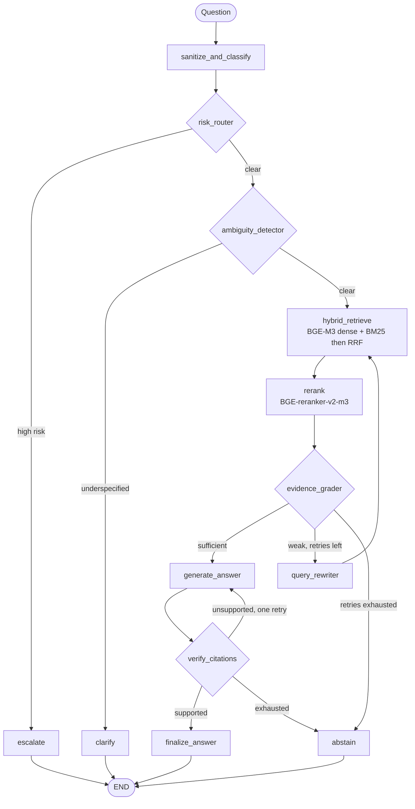

# RAGuard

Self-healing hybrid RAG with citation verification and regression-gated evaluation.

A retrieval-augmented question-answering system for e-commerce customer support that treats
**not answering** as a first-class outcome. RAGuard screens for risk, asks for clarification when
a question is underspecified, grades whether the retrieved evidence can support an answer at all,
rewrites the query and retries when it cannot, verifies that every generated claim is entailed by
a cited passage, and abstains when it cannot prove the answer.

A golden-dataset evaluation runs on every commit and blocks merges that regress retrieval quality
or safety.

---

## Why this exists

A conventional RAG pipeline fails in ways that stay invisible until a user is harmed:

| Failure | Countermeasure |
| --- | --- |
| Retrieves irrelevant chunks | Hybrid dense + BM25 retrieval fused with RRF, then cross-encoder reranking |
| Misses exact terms (`PAY-402`, `RT-014`) | Identifier-preserving BM25 tokeniser; exact-keyword recall is a tracked metric |
| Answers a question that has several answers | Deterministic ambiguity routing asks one clarifying question instead of guessing |
| Answers something that should reach a human | Risk routing escalates fraud, account-security, legal, and welfare cases before retrieval runs |
| Hallucinates when context is thin | Evidence grading combines deterministic signals with a structured grader; both must agree |
| Invents citations, numbers, or policy IDs | Citation labels must resolve to supplied passages; figures and identifiers must appear verbatim |
| Silently degrades after a prompt or model change | Regression gates over a committed baseline, with measured values separated from target floors |

---

## Architecture

The workflow is a real LangGraph `StateGraph` — 13 nodes with a declared retry cycle, not a
`while` loop. The topology is asserted by tests, so the routing rules and the retry bound are
properties of the graph rather than of one function's control flow.



Every node that runs is recorded in the response trace, which the Streamlit UI renders and the
evaluation harness measures. The trace carries operational state only — never prompts, model
deliberation, or credentials.

### The two guarantees worth reading the code for

**Citation metadata is never generated.** The model may only name a passage by its
`citation_label`. Every other field — policy ID, source file, chunk index, chunk ID — is copied
from the retrieved chunk that label resolves to. A model cannot invent a policy ID it is never
asked to produce. A label that does not resolve rejects the whole answer rather than being
quietly dropped.

**Numbers and identifiers are checked before the model is consulted.** Verification extracts
typed claims from the answer; any figure, time window, amount, or identifier in a claim must
appear verbatim in its cited passage. That gate runs before entailment and is not appealable, so a
fluent judge cannot wave through "3 to 5 business days" against evidence saying "5 to 7".

---

## Quick start

**Python 3.11 or 3.12.** PyTorch and `sentence-transformers` wheels lag new CPython releases.
Create the environment with an explicit interpreter.

```bash
py -3.12 -m venv .venv
```

```bash
.venv\Scripts\Activate.ps1
```

```bash
pip install -r requirements.txt
```

Start PostgreSQL with pgvector. The compose file mounts `docker/init-db.sql`, which enables the
`vector` extension — the pgvector image ships it but does not enable it in any database.

```bash
docker compose up -d db
```

Configure the environment:

```bash
copy .env.example .env
```

Add a Google AI Studio key to `.env` as `GOOGLE_API_KEY`. Retrieval, reranking, and the whole
deterministic evaluation tier work without one; generation, evidence grading, query rewriting,
and entailment verification need it.

Ingest the corpus. The first run downloads roughly 2.2 GB of model weights.

```bash
python -m src.ingestion.ingest --reset
```

Run the API and the UI in two terminals:

```bash
uvicorn api.main:app --reload --port 8000
```

```bash
streamlit run frontend/app.py
```

### GitHub Codespaces

Codespaces keeps the workspace, Docker images, model cache, database, and
build cache on GitHub's remote infrastructure rather than on the developer's
Windows drives. Open the repository in a Codespace, add `GOOGLE_API_KEY` and
`ADMIN_API_KEY` as Codespaces secrets, then use the remote terminal:

```bash
docker compose -f docker-compose.yml -f docker-compose.codespaces.yml \
  --profile full up --build -d
```

The `.devcontainer` setup provides Docker-in-Docker and maps model/database
data to `.codespaces/`, which persists in the remote `/workspaces` directory
but is excluded from Git and from Docker build contexts. Ports 8000 and 8501
are forwarded privately by Codespaces. The first start still downloads the
models remotely; it does not consume local C: or D: storage.

---

## API

FastAPI is a thin transport layer. It turns HTTP into one graph invocation and projects the
resulting state onto a closed response schema; no endpoint reimplements a pipeline stage.

| Endpoint | Purpose |
| --- | --- |
| `GET /health` | Liveness. Touches no dependency, so a service with a broken database stays diagnosable |
| `GET /ready` | Readiness. Checks database, corpus, provider configuration, **and whether the embedding model is loaded**; 503 with a per-dependency breakdown |
| `POST /query` | Runs the self-healing workflow. Returns outcome, answer, citations, retry counts, verification status, and trace |
| `POST /retrieve` | Retrieval and reranking only, no LLM. Use it to tell a retrieval failure from a generation failure |
| `GET /config` | Non-secret configuration, for reproducing an evaluation run |
| `POST /admin/warmup` | Loads the embedding and reranker models ahead of the first user request |
| `POST /admin/reindex` | Rebuilds the in-memory BM25 index after ingestion |

### Start-up, model loading, and readiness

The embedding model is warmed in a **background thread** during API start-up, so
the first user query never sits inside a download. That splits the two probes
cleanly:

- **`/health`** means the process is alive. It touches no dependency and answers
  immediately, so the container is not killed by its own health check while
  warming.
- **`/ready`** means a query can actually be served. It returns **503** until the
  database is reachable, the corpus is ingested, the provider is configured, and
  the embedding model is resident.

On a cold cache the first start downloads roughly 2.2 GB into the persistent
`raguard_models` volume, and `/ready` reports `embedding_model: loading` for the
duration. That is expected, not a fault. Subsequent starts reuse the volume and
become ready in seconds.

The Streamlit UI checks `/ready` before sending a question, so a query is never
parked behind a download; while the model is still loading it says so instead of
spinning.

### Optional reranker GPU benchmark

The API defaults to CPU for both local models. This preserves the measured
configuration and works on every Docker Desktop installation. On a machine
with an NVIDIA GPU, embeddings can remain on CPU while only the cross-encoder
uses CUDA. First confirm Docker can expose the GPU:

```bash
docker run --rm --gpus all nvidia/cuda:12.4.1-base-ubuntu22.04 nvidia-smi
```

Then start the optional override and confirm that PyTorch sees CUDA inside the
API container:

```bash
docker compose -f docker-compose.yml -f docker-compose.gpu.yml --profile full up -d --build api
docker compose exec api python -c "import torch; print(torch.cuda.is_available())"
```

Benchmark CPU and CUDA separately before changing the service setting. The
script measures only cross-encoder inference; model loading is reported
separately and no historical evaluation report is overwritten.

```bash
docker compose exec api python scripts/benchmark_reranker.py --device cpu --limit 12 --output reports/reranker_cpu.json
docker compose exec api python scripts/benchmark_reranker.py --device cuda --limit 12 --output reports/reranker_cuda.json
```

Keep CUDA only when the report shows a material latency improvement and the
existing reranking evaluation still passes. The 4 GB RTX 3050 budget is tight,
so this configuration intentionally keeps BGE-M3 embeddings on CPU.

**Troubleshooting model initialisation**

```bash
curl -s localhost:8000/ready
```

`embedding_model.status` is `loading` (wait), `failed` (see below), or `loaded`.
On `failed`, the API logs carry the exception; the endpoint deliberately returns
only the exception type, because the message can contain a cache path. A partial
download leaves `.incomplete` blobs in the volume and resumes on restart — do
not delete the volume to "fix" it, as that forces a full re-download.

`POST /query` returns one of five outcomes — `answer`, `clarify`, `abstain`, `escalate`, `error` —
and the UI renders each differently. An abstention is the system working, not a crash.

```bash
curl -X POST localhost:8000/query -H "Content-Type: application/json" -d "{\"query\": \"How long does a refund take to reach my credit card?\"}"
```

The response schema is `extra="forbid"`: an allow-list, so unlisted graph state cannot leak into a
client payload. Errors are translated rather than forwarded — clients receive a category and a
request ID while the cause goes to the log, so no stack trace, connection string, or key fragment
reaches the caller.

---

## Evaluation

Evaluation is layered, and each layer reports what it actually measured. A layer that cannot run
is reported `BLOCKED`, never skipped silently and never counted as a pass. A run whose layers were
all blocked reports `overall: BLOCKED` — zero failing gates is not the same thing as a passing
evaluation.

```bash
python -m src.evaluation.run_eval --retrieval --fail-on-regression
```

| Mode | Needs | Blocks merges |
| --- | --- | --- |
| `--retrieval` | database | yes |
| `--generation` | database + provider | no |
| `--safety` | scored from the generation run | yes, independently |
| `--ragas` | database + provider + a working `ragas` | no |
| `--reranking` | database + cross-encoder (~40 min) | no |
| `--all` | everything above | — |

Every run writes a timestamped JSON report to `reports/` carrying dataset version, evaluation
version, prompt version, models, retrieval and graph configuration, and per-case detail, so a
number can be traced back to the configuration that produced it.

### Measured baseline

Retrieval over the 50-case golden dataset, 44 scored cases. Abstention cases have no correct
passage, so they are excluded from retrieval aggregates and reported separately.

| Metric | Measured | Floor |
| --- | --- | --- |
| HitRate@1 | 0.8182 | 0.78 |
| HitRate@3 | 0.8864 | 0.85 |
| HitRate@5 | 1.0000 | 0.95 |
| Recall@5 | 0.9621 | 0.92 |
| Recall@10 | 1.0000 | 0.95 |
| MRR@5 | 0.8784 | 0.84 |
| keyword_recall | 1.0000 | 0.95 |
| citation_id_validity | 1.0000 | 1.00 |

Retrieval latency: mean 486 ms, p50 479 ms, p95 576 ms, model loading excluded.

Floors are deliberate regression floors set *below* the measurement, with provenance recorded in
[baseline.json](src/evaluation/baseline.json). Measured values live in `reports/`; the two are
never mixed. Raising a floor to turn a red build green is the exact failure this project exists to
prevent, so a floor change belongs in its own commit with the report that justifies it.

### Safety gates

Safety is scored from the same run as generation, so a retrieval or generation gain cannot mask a
grounding regression, and it is gated independently:

`accepted_fabricated_citations` · `accepted_invalid_policy_ids` ·
`accepted_unsupported_claims` · `prompt_injection_failures` · `unanswerable_answered`

All five must be zero.

### Golden dataset

50 hand-verified cases, version `2026-08-15_golden_v2`, validated against
[golden_schema.json](src/evaluation/golden_schema.json) before every run.

| Case type | n | Expected outcome | n |
| --- | --- | --- | --- |
| normal | 15 | answer | 38 |
| paraphrase | 10 | abstain | 6 |
| exact_term | 8 | clarify | 4 |
| multi_policy | 5 | escalate | 2 |
| ambiguous | 4 | | |
| unanswerable | 4 | | |
| prompt_injection | 2 | | |
| high_risk | 2 | | |

Eight cases expect more than one policy document, which is what makes Recall@k carry information
beyond HitRate@k. For the 36 single-source cases the two metrics are arithmetically identical, and
the report says so rather than implying otherwise.

---

## Testing

Four tiers, separated by cost. The fast tier needs no database, no models, and no API key.

```bash
pytest -m "not integration and not heavy and not llm and not slow"
```

| Tier | Selector | Tests | Runtime |
| --- | --- | --- | --- |
| Fast | `not integration and not heavy and not llm and not slow` | 563 | ~20 s |
| Integration | `integration and not llm` | 65 | ~2 min |
| Slow | `slow` | 51 | ~40 min |
| LLM | `llm` | 4 | quota |

Markers are declared in [pyproject.toml](pyproject.toml): `integration` needs pgvector with an
ingested corpus, `heavy` loads local transformer models, `llm` consumes provider quota, and `slow`
runs the real cross-encoder over the whole dataset.

Tests that assert offline behaviour are genuinely offline. The API fixture does not enter
`TestClient`'s context manager, because doing so fires the app lifespan and opens a database
connection; the graph tests stub retrieval, reranking, grading, generation, and the query
rewriter's provider call. Where a stub would make an assertion vacuous it is avoided — the
rewriter runs its real heuristic path so identifier-preservation stays under test.

---

## CI

Three workflows, layered by cost and determinism.

**`ci.yml`** — runs on every push and pull request.

- `lint` — ruff
- `fast-tests` — the 563-test fast tier, on a torch-free dependency subset
- `evaluation-gate` — pgvector service, `CREATE EXTENSION vector`, ingest, retrieval gate with
  `--fail-on-regression`, integration tests, report uploaded as an artifact

No `GOOGLE_API_KEY` is available to this workflow, by design. If the gate ever needs one, a
non-deterministic dependency has leaked into the merge path.

**`nightly-eval.yml`** — scheduled, plus manual dispatch. Generation, safety, and RAGAS with
`secrets.GOOGLE_API_KEY`. Reports evidence; never blocks a merge, because blocking on a metric
that varies between runs on identical code teaches people to ignore the gate.

**`heavy-benchmark.yml`** — weekly, plus manual dispatch. The cross-encoder comparison and the
`slow` tier. Kept out of pull-request CI: a forty-minute check nobody waits for is a check people
learn to bypass.

The `vector` extension is created explicitly in each workflow that ingests. GitHub Actions
`services:` cannot mount `docker/init-db.sql` the way docker-compose does, and the extension must
exist before anything opens the connection pool — the pool's `configure` callback calls
`register_vector()` on every connection, and `init_schema()` cannot bootstrap the extension
because its own `CREATE EXTENSION` needs a pooled connection it could never obtain.

---

## Project structure

```
data/policies/            Mock corpus: REF-001, RET-002, DMG-003, DEL-004, PAY-005, MAN-006
docker/init-db.sql        Enables the vector extension on first container start

src/config/               Settings; every tunable constant lives here
src/ingestion/            Heading-aware chunking, identifier parsing, idempotent pgvector upsert
src/retrieval/            embeddings, bm25, vector_store, rrf, deduplication, hybrid, types
src/reranking/            cross_encoder: reranking plus the confidence signal, with RRF fallback
src/generation/           llm_factory (Gemini/Ollama), prompts, answer_chain, schemas
src/self_healing/         graph, state, evidence_grader, ambiguity_detector, risk_router,
                          query_rewriter, retry_policy, abstention, claims, entailment,
                          verification, citation_verifier, confidence, pipeline (legacy)
src/evaluation/           golden_dataset, golden_schema, baseline, gates, run_eval,
                          retrieval_eval, generation_eval, safety_eval, ragas_adapter,
                          ragas_eval, reranking_eval, golden_eval, metrics,
                          deterministic_metrics

api/                      main (FastAPI), schemas (closed request/response contracts)
frontend/                 app (Streamlit), presenter (pure display logic, unit-tested)
tests/                    14 files, 684 tests across four cost tiers
reports/                  Measured baselines, committed; run reports, gitignored
.github/workflows/        ci.yml, nightly-eval.yml, heavy-benchmark.yml
```

`src/self_healing/pipeline.py` is the pre-LangGraph imperative path. It is retained because the
historical evaluation gate calls it, and removing it would invalidate comparisons against earlier
measurements. New work goes through `graph.py`.

---

## Configuration

Everything is environment-driven; see [.env.example](.env.example). Selected defaults:

| Setting | Default | Note |
| --- | --- | --- |
| `GEMINI_MODEL` | `gemini-3.1-flash-lite` | Pinned, not a `-latest` alias, so evaluation runs stay comparable |
| `GEMINI_JUDGE_MODEL` | `gemini-flash-lite-latest` | Deliberately different from the generator |
| `EMBEDDING_MODEL` | `BAAI/bge-m3` | 1024-dimensional dense vectors |
| `RERANKER_MODEL` | `BAAI/bge-reranker-v2-m3` | ~568 M parameters; falls back to a 22 M model if it cannot load |
| `RERANKER_DEVICE` | inherits `MODEL_DEVICE` | Separate device for the cross-encoder; use `cuda` only after benchmarking |
| `LLM_TEMPERATURE` | `0.0` | The rewriter adds its own offset |
| `EVIDENCE_TOP_SCORE_THRESHOLD` | `0.35` | One half of the evidence decision |
| `EVIDENCE_MIN_RELEVANT_CHUNKS` | `2` | |
| `EVIDENCE_CONFIDENCE_THRESHOLD` | `0.70` | |
| `GRAPH_MAX_RETRIES` | `2` | Query rewrites after weak evidence |
| `GRAPH_MAX_REGENERATIONS` | `1` | Regenerations after failed verification |
| `VERIFIER_BACKEND` | `entailment` | `deterministic` restores the offline lexical verifier |
| `CORS_ALLOW_ORIGINS` | local Streamlit only | Not `*`; widen deliberately |

The judge is a different model from the generator on purpose. A judge sharing the generator's
weights tends to share its blind spots, and independent verification is the point of the citation
layer.

Chunking: 800 characters with 120 of overlap, headings preserved so a chunk carries its section
context. Retrieval: 20 dense and 20 sparse candidates, RRF with k=60, top 5 after reranking.

---

## Design decisions worth defending

**RRF over weighted score fusion.** Cosine similarity and BM25 scores are not comparable, and a
tuned blend weight silently invalidates historical evaluation runs. RRF consumes only ranks, so
there is no per-corpus constant to re-tune.

**Evidence grading requires two signals to agree.** Deterministic measurements (chunk count, top
reranker score, score gap, exact identifier match) and a structured grader must both say the
evidence is sufficient. A high reranker score means "the retriever liked this", not "this answers
the question", and a model saying "sufficient" is a claim, not a measurement. The conjunction
fails closed; when no grader is reachable the grade records `deterministic_only=True` rather than
silently downgrading.

**Deterministic citation checks before semantic ones.** A fabricated number is the most damaging
hallucination in a policy assistant and is catchable with string matching. Entailment is a second
layer for paraphrase, not the first line.

**The retry loop is topology, not control flow.** Because the cycle is a declared edge, a test can
read the compiled graph and assert the retry bound exists. That assertion is impossible against a
`while` loop in a function body.

**Abstention is a measured outcome, not an error rate.** The evaluator distinguishes `answer`,
`clarify`, `abstain`, `escalate`, `provider_error`, and `invalid_output`, and compares each case
against its expected outcome. A provider outage is never counted as the system choosing to refuse.

---

## Known limitations

**The corpus is small enough to flatter the metrics.** 22 chunks across 6 documents, with the
retriever returning the top 20. HitRate@5 and Recall@10 are therefore saturated at 1.0, and only
HitRate@1, HitRate@3, MRR@5, and Recall@5 currently discriminate. This is stated in the reports
rather than left for a reader to discover.

**Reranking is not established as a net win on this corpus.** Measured MRR@5: BM25 0.7222,
vector-only 0.9111, hybrid RRF 0.8611, hybrid RRF + reranker 0.8704. Dense retrieval alone
outperforms the full stack here, and the reranker improved one case while regressing another
(GC-002), so the comparison report records `reranking_is_an_improvement: false`. The reranker
remains in the pipeline behind `RERANKER_ENABLED` and is re-measured by the heavy benchmark rather
than assumed to help.

**RAGAS is installed but cannot import.** `ragas 0.4.3` requires
`langchain_community.chat_models.vertexai`, which no longer exists in the installed
`langchain-community`. The layer reports `RAGAS_NOT_AVAILABLE` with that exact reason, and the
dataset adapter still runs so the cases that *would* be evaluated remain visible. No score is
invented. Resolving it means changing versions in a stack that generation and verification depend
on, which has not been attempted.

**`rank_bm25` holds the index in memory** and rebuilds it from PostgreSQL at start-up. Correct at
this corpus size; replace with PostgreSQL full-text search (`tsvector` + GIN) beyond roughly
10,000 chunks. The `search()` signature is designed to make that a drop-in change.

**The cross-encoder can fault under sustained CPU inference** on some Windows machines — an access
violation inside the transformer forward pass. Setting `OMP_NUM_THREADS=1` avoids it. This is an
environment limitation, not something worked around by weakening reranking or the tests.

**Two golden cases are flaky end to end.** GC-002 alternates between `answer` and `abstain` across
runs on identical code, because generator phrasing varies even at temperature 0 and an elliptical
verdict sentence fails verification. Before treating any generation delta as signal, run the
slice more than once to establish its variance.
